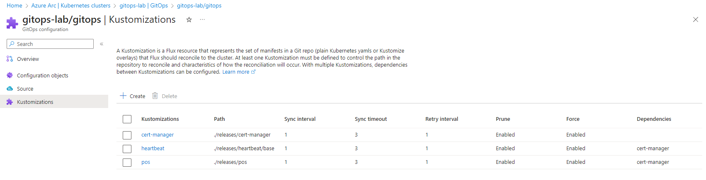
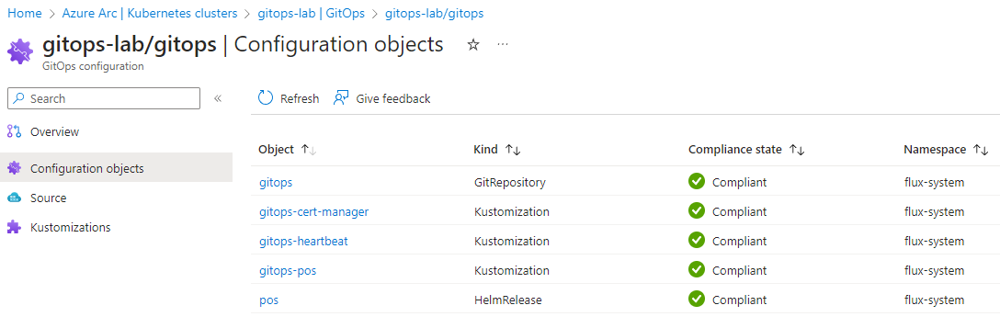

# Azure Arc for GitOps Sample

- A sample GitOps repository for Azure Arc for GitOps

## Prerequisites

- Azure Arc enabled Kubernetes Cluster
- az CLI (logged into the correct subscription)
- kubectl CLI (logged into the correct cluster)
- A GitHub Personal Access Token with `repo` permissions
  - If using SSO, make sure to enable the PAT for the GitHub organization

## Lab Goals

At the end of this lab, you will have an Arc enabled GitOps cluster with 3 Kustomizations and a Helm Release





## Install Arc for GitOps

- Set environment variables
- Update as needed

```bash

export PAT=myPersonalAccessToken
export CLUSTER_NAME=gitops-lab
export ARC_RG=arc
export CONFIG_NAME=gitops

```

## Create cert-manager Kustomization

- `releases/cert-manager` is a YAML deployment manifest
- Create the Flux configuration and the Kustomization at the same time

```bash

az k8s-configuration flux create \
  --cluster-type connectedClusters \
  --interval 1m \
  --kind git \
  --name $CONFIG_NAME \
  --namespace flux-system \
  --scope cluster \
  --timeout 3m \
  --https-user $CONFIG_NAME \
  --cluster-name $CLUSTER_NAME \
  --resource-group $ARC_RG \
  --url https://github.com/bartr/gitops \
  --branch main \
  --https-key "$PAT" \
  --kustomization \
      name=cert-manager \
      path=./releases/cert-manager \
      timeout=3m \
      sync_interval=1m \
      retry_interval=1m \
      prune=true \
      force=true

```

- Check cert-manager

```bash

kubectl get kustomizations -n flux-system
kubectl get pods -n cert-manager

```

## Create heartbeat Kustomization

- `releases/heartbeat` is a Kustomization manifest
- The configuration `depends on` the `cert-manager` Kustomization
- Since the `gitops` configuration is already created, only add the Kustomization

```bash

az k8s-configuration flux kustomization create \
  --kustomization-name heartbeat \
  --path ./releases/heartbeat/base \
  --depends-on cert-manager \
  --name $CONFIG_NAME \
  --cluster-name $CLUSTER_NAME \
  --resource-group $ARC_RG \
  --cluster-type connectedClusters \
  --sync-interval 1m \
  --timeout 3m \
  --prune \
  --force

```

- Check heartbeat

```bash

kubectl get kustomizations -n flux-system
kubectl get pods -n heartbeat

```

## Create POS Helm Chart

- `releases/pos` is a Flux HelmRelease CRD
  - This will result in a POS Kustomization and HelmRelease in Azure Arc GitOps
- The configuration `depends on` the `cert-manager` Kustomization
- Since the `gitops` configuration is already created, only add the Kustomization

```bash

az k8s-configuration flux kustomization create \
  --kustomization-name pos \
  --path ./releases/pos \
  --depends-on cert-manager \
  --name $CONFIG_NAME \
  --cluster-name $CLUSTER_NAME \
  --resource-group $ARC_RG \
  --cluster-type connectedClusters \
  --sync-interval 1m \
  --timeout 3m \
  --prune \
  --force

```

- Check POS

```bash

kubectl get kustomizations -n flux-system
kubectl get helmreleases -n flux-system
kubectl get pods -n pos

```

## Delete the Arc GitOps config

- Delete the GitOps config object (including Kustomizations)

```bash

az k8s-configuration flux delete \
  --name $CONFIG_NAME \
  --cluster-name $CLUSTER_NAME \
  --resource-group $ARC_RG \
  --cluster-type connectedClusters \
  --yes

```

## Support

This project uses GitHub Issues to track bugs and feature requests. Please search the existing issues before filing new issues to avoid duplicates.  For new issues, file your bug or feature request as a new issue.

## Contributing

This project welcomes contributions and suggestions and has adopted the [Contributor Covenant Code of Conduct](https://www.contributor-covenant.org/version/2/1/code_of_conduct.html).

For more information see [Contributing.md](./.github/CONTRIBUTING.md)

## Trademarks

This project may contain trademarks or logos for projects, products, or services. Any use of third-party trademarks or logos are subject to those third-party's policies.
